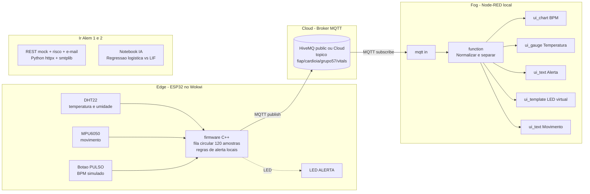

# Faculdade de Informatica e Administracao Paulista

<p align="center">
  
</p>

# CardioIA Conectada - IoT e Visualizacao de Dados para a Saude Digital

**FIAP | Tecnologo em Inteligencia Artificial | Fase 3 | Capitulo 1**

## Grupo 57

| Integrante | GitHub |
|---|---|
| Felipe Sabino da Silva | [@FelipeSabinoTMRS](https://github.com/FelipeSabinoTMRS) |
| Juan Felipe Voltolini | [@juanvoltolini-rm562890](https://github.com/juanvoltolini-rm562890) |
| Luiz Henrique Ribeiro de Oliveira | [@Luiz-FIAP](https://github.com/Luiz-FIAP) |
| Marco Aurelio Eberhardt Assimpção | [@marcofiap](https://github.com/marcofiap) |
| Paulo Henrique Senise | [@PauloSenise](https://github.com/PauloSenise) |

## Descricao

Este repositorio implementa a fase **CardioIA Conectada**, continuidade do projeto da Fase 2. Na etapa anterior, a CardioIA explorou diagnostico assistido por regras e classificacao textual de risco cardiologico. Nesta fase, a solucao avanca para um prototipo IoT de monitoramento continuo, simulando um dispositivo vestivel com ESP32, sensores, processamento local, comunicacao MQTT, dashboard Node-RED e alertas automaticos.

O sistema simula o fluxo completo de dados em saude digital:

```text
captura -> edge/resiliencia -> MQTT -> fog/cloud -> dashboard -> alerta
```

### Arquitetura Edge / Fog / Cloud



O prototipo usa tres sensores no Wokwi:

- DHT22 para temperatura e umidade (sensor obrigatorio do enunciado);
- botao de pressao como sensor de pulso, simulando batimentos por minuto;
- MPU6050 (acelerometro I2C) para detectar movimento, alinhado com o exemplo das apostilas Cap 8 e 9 da Fase 3.

Tambem foram implementados os desafios "Ir Alem":

- **Ir Alem 1**: cliente REST em Python com verificacao de risco e simulacao de e-mail.
- **Ir Alem 2**: notebook comparando regressao logistica com um modelo neuromorfico LIF simples em serie temporal de batimentos.

## Estrutura de pastas

```text
.
|-- assets/
|   |-- logo-fiap.png
|   `-- evidencias/
|       `-- README.md
|-- config/
|   `-- mosquitto.conf
|-- docs/
|   |-- checklist_enunciado.md
|   |-- referencias_apostilas_resumo.txt
|   |-- validacao_local.md
|   |-- relatorio_parte1_edge.md
|   |-- relatorio_parte2_mqtt_dashboard.md
|   |-- relatorio_ir_alem1_rest_email.md
|   |-- relatorio_ir_alem2_ia_series_temporais.md
|   |-- reflexao_seguranca_lgpd.md
|   `-- roteiro_video.md
|-- document/
|   `-- ai_project_document_fiap.md
|-- notebooks/
|   `-- ir_alem2_series_temporais_saude.ipynb
|-- scripts/
|   |-- compute_ir_alem2_metrics.py
|   |-- mqtt_loopback_test.js
|   |-- mqtt_monitor.js
|   |-- mqtt_publish_test.js
|   `-- wokwi_serial_monitor.py
|-- src/
|   |-- wokwi/
|   |   |-- sketch.ino
|   |   |-- diagram.json
|   |   `-- libraries.txt
|   |-- node-red/
|   |   `-- flows_cardioia_node_red.json
|   `-- rest-email/
|       |-- cardioia_rest_email.py
|       `-- requirements.txt
`-- README.md
```

## Como executar

### Parte 1 e Parte 2 - ESP32 no Wokwi

1. Crie um projeto ESP32 no Wokwi.
2. Copie `src/wokwi/sketch.ino`, `src/wokwi/diagram.json` e `src/wokwi/libraries.txt`.
3. Ajuste no firmware, se necessario:
   - `MQTT_SERVER`
   - `MQTT_PORT`
   - `MQTT_USER`
   - `MQTT_PASSWORD`
4. Execute a simulacao.
5. Use o Monitor Serial para acompanhar:
   - leituras coletadas;
   - estado online/offline;
   - fila local de resiliencia;
   - publicacoes MQTT.

No Cursor/VS Code, o projeto tambem expoe a serial simulada na porta `4000`. Para acompanhar logs no terminal:

```bash
python scripts/wokwi_serial_monitor.py
```

Se a extensao pedir um arquivo de configuracao e o workspace aberto for a raiz do projeto, selecione:

```text
C:\fiap\2 ano\fase3cap1\wokwi.toml
```

Se o Cursor/Wokwi estiver iniciando a simulacao a partir da pasta `src\wokwi`, use:

```text
C:\fiap\2 ano\fase3cap1\src\wokwi\wokwi.toml
```

Os dois arquivos apontam para o mesmo firmware compilado em `.pio/build/esp32dev/`, entao nao ha diferenca funcional. Eles existem apenas para cobrir os dois modos como a extensao Wokwi pode resolver o workspace.

O projeto nao fixa manualmente `[net] gateway`, para deixar o Wokwi for VS Code/Cursor usar o gateway padrao da extensao. Se for necessario usar um gateway privado manual, rode o `wokwigw` e so entao adicione `gateway = "ws://localhost:9011"` aos arquivos `wokwi.toml`.

Se o Wi-Fi nao conectar no simulador, verifique primeiro o Monitor Serial:

- `chave=OFFLINE`: alterne a chave do circuito para a posicao online.
- `chave=ONLINE` e `Wi-Fi indisponivel`: habilite o gateway IoT do Wokwi/Cursor ou use o Wokwi Web. No modo manual, rode `wokwigw` e adicione:

```toml
[net]
gateway = "ws://localhost:9011"
```

Se o Wi-Fi conectar, mas o Node-RED nao receber os dados, confira no Monitor Serial:

- `MQTT conectado.` e `MQTT publicado:` indicam que o ESP32 enviou para o broker.
- `Publicacao bloqueada: MQTT nao conectado` indica problema entre o Wokwi e o broker.
- O dashboard atual mostra BPM no grafico e temperatura no gauge; ao alterar a temperatura do DHT22, espere ate 5 segundos para a proxima amostra.

### Dashboard Node-RED

1. Instale Node-RED e os dashboards:

```bash
npm install -g node-red
mkdir -p ~/.node-red
npm install --prefix ~/.node-red node-red-dashboard
node-red --userDir ~/.node-red
```

No PowerShell, se preferir:

```powershell
New-Item -ItemType Directory -Force -Path "$env:USERPROFILE\.node-red"
npm install --prefix "$env:USERPROFILE\.node-red" node-red-dashboard
node-red --userDir "$env:USERPROFILE\.node-red"
```

2. Acesse `http://127.0.0.1:1880`.
3. Importe o fluxo `src/node-red/flows_cardioia_node_red.json`.
4. Configure o broker MQTT no node `mqtt in`, se estiver usando HiveMQ Cloud ou Mosquitto local.
5. Clique em `Deploy`.
6. Abra `http://127.0.0.1:1880/ui`.

Para monitorar no terminal se as mensagens MQTT estao chegando ao broker:

```bash
node scripts/mqtt_monitor.js
```

O fluxo Node-RED tambem registra no terminal cada payload que chega do MQTT. Para ver esse log, rode o Node-RED em primeiro plano:

```bash
node-red --userDir ~/.node-red
```

Quando o Wokwi publicar, o terminal deve exibir linhas parecidas com:

```text
CardioIA MQTT recebido: {"deviceId":"cardioia-esp32-grupo57","temperature":39.4,"humidity":40,"bpm":88,"alert":true}
```

Para publicar uma mensagem de teste no mesmo topico:

```bash
node scripts/mqtt_publish_test.js
```

Use esse teste para isolar o problema:

- se o `mqtt_publish_test.js` aparece no Node-RED, o Node-RED esta correto e o problema esta no ESP32/Wokwi;
- se o `mqtt_publish_test.js` nao aparece no Node-RED, revise o import do fluxo, o deploy e o broker do node MQTT.

Para validar o caminho completo de publicacao e recebimento MQTT pelo broker:

```bash
node scripts/mqtt_loopback_test.js
```

### Ir Alem 1 - REST e e-mail

```bash
cd src/rest-email
pip install -r requirements.txt
python cardioia_rest_email.py
```

Por padrao, o script usa uma API REST simulada em memoria e imprime o e-mail no console. Para envio SMTP real, defina variaveis de ambiente:

```bash
set SMTP_HOST=smtp.example.com
set SMTP_PORT=587
set SMTP_USER=usuario
set SMTP_PASSWORD=senha
set ALERT_TO=destino@example.com
```

### Ir Alem 2 - Notebook

```bash
pip install numpy pandas scikit-learn matplotlib notebook
python -m notebook notebooks/ir_alem2_series_temporais_saude.ipynb
```

Para reproduzir as metricas de forma headless (util para CI ou para citar no relatorio):

```bash
python scripts/compute_ir_alem2_metrics.py
```

## Documentacao adicional

- `docs/relatorio_parte1_edge.md` - Edge Computing, fila circular e diagrama do circuito.
- `docs/relatorio_parte2_mqtt_dashboard.md` - MQTT, HiveMQ, QoS e mapeamento Node-RED.
- `docs/relatorio_ir_alem1_rest_email.md` - REST, regras de risco e e-mail.
- `docs/relatorio_ir_alem2_ia_series_temporais.md` - regressao logistica vs LIF, com metricas.
- `docs/reflexao_seguranca_lgpd.md` - reflexao sobre seguranca, IoT medico e LGPD.
- `document/ai_project_document_fiap.md` - documento mestre seguindo o Template FIAP.

## Links para entrega

- GitHub publico: <https://github.com/marcofiap/CardioIA-Fase3-Cap1>
- Link Wokwi: `INSERIR_LINK_DO_WOKWI`
- Link video YouTube nao listado: `INSERIR_LINK_DO_VIDEO`

## Evidencias para anexar antes da entrega final

Salvar os prints em `assets/evidencias/`:

- `wokwi_execucao.png`: simulacao rodando com Monitor Serial.
- `node_red_flow.png`: fluxo importado no Node-RED.
- `node_red_dashboard.png`: dashboard em `/ui`.
- `alerta_dashboard.png`: exemplo com alerta ativo.

A validacao local de firmware, JSONs, REST/e-mail, MQTT e notebook esta documentada em `docs/validacao_local.md`.

## Checklist do enunciado

- [x] ESP32 com no minimo dois sensores.
- [x] DHT22 para temperatura e umidade.
- [x] Sensor adicional de pulso simulado por botao.
- [x] MPU6050 (acelerometro) para movimento, alinhado com Cap 8 e 9 da Fase 3.
- [x] Processamento local e regras de alerta na borda.
- [x] Resiliencia offline por fila circular limitada.
- [x] Envio de dados via MQTT.
- [x] Dashboard Node-RED com grafico, gauge, alerta e indicador de movimento.
- [x] Relatorios das Partes 1 e 2 (acima do minimo de paginas).
- [x] Ir Alem 1 com REST, risco e e-mail.
- [x] Ir Alem 2 com comparacao entre modelo tradicional e neuromorfico em dois cenarios.
- [x] Reflexao dedicada de seguranca, IoT medico e LGPD (`docs/reflexao_seguranca_lgpd.md`).
- [x] Documento mestre seguindo Template FIAP (`document/ai_project_document_fiap.md`).
- [x] Diagrama de arquitetura Edge/Fog/Cloud no README e nos relatorios.
- [ ] Link publico do Wokwi preenchido.
- [ ] Prints da execucao anexados.
- [ ] Link do video de ate 4 minutos preenchido.

## Observacao academica

Este projeto e uma simulacao academica. Os alertas e classificacoes nao substituem avaliacao medica, validacao clinica, certificacao regulatoria ou protocolos reais de atendimento.
