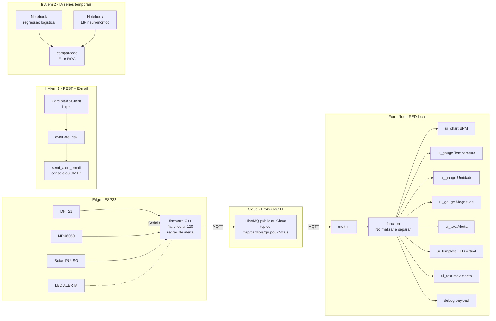

# AI Project Document - CardioIA Conectada

**FIAP | Tecnologo em Inteligencia Artificial | Fase 3 | Capitulo 1 | Grupo 57**

## Integrantes do grupo

- Felipe Sabino da Silva ([@FelipeSabinoTMRS](https://github.com/FelipeSabinoTMRS))
- Juan Felipe Voltolini ([@juanvoltolini-rm562890](https://github.com/juanvoltolini-rm562890))
- Luiz Henrique Ribeiro de Oliveira ([@Luiz-FIAP](https://github.com/Luiz-FIAP))
- Marco Aurelio Eberhardt Assumpcao ([@marcofiap](https://github.com/marcofiap))
- Paulo Henrique Senise ([@PauloSenise](https://github.com/PauloSenise))

## Sumario

[1. Introducao](#c1)

[2. Visao Geral do Projeto](#c2)

[3. Desenvolvimento do Projeto](#c3)

[4. Resultados e Avaliacoes](#c4)

[5. Conclusoes e Trabalhos Futuros](#c5)

[6. Referencias](#c6)

[Anexos](#c7)

<br>

# <a name="c1"></a>1. Introducao

## 1.1. Escopo do Projeto

### 1.1.1. Contexto da Inteligencia Artificial

O projeto se insere no segmento de **saude digital conectada (Connected Health)**, em que dispositivos vestiveis e sensores corporais capturam sinais vitais continuamente, processam decisoes na borda, transmitem dados via redes IoT e os entregam a equipes assistenciais em dashboards e automacoes. Esse segmento e global, em rapida expansao no Brasil e movimentado por startups, hospitais e operadoras que buscam reduzir desfechos cardiologicos adversos por meio de monitoramento continuo. O capitulo de referencia (Fase 3 Cap 1) coloca a CardioIA como fio condutor para integrar IoT, Edge/Fog/Cloud e visualizacao.

### 1.1.2. Descricao da Solucao Desenvolvida

Foi desenvolvido um prototipo funcional de wearable cardiologico com:

- ESP32 simulado no Wokwi com tres sensores: DHT22 (temperatura/umidade), botao de pressao (BPM) e MPU6050 (movimento via acelerometro);
- regras locais de alerta (Edge Computing) para febre, taquicardia e ausencia/excesso de movimento;
- fila circular de resiliencia offline com 120 amostras (10 minutos);
- transmissao MQTT para HiveMQ (broker publico ou Cloud com TLS);
- dashboard Node-RED com grafico de BPM, gauge de temperatura, indicador textual e LED virtual de alerta;
- automacao Python que consome API REST, classifica risco e simula envio de e-mail de alerta;
- experimento de IA em series temporais comparando regressao logistica e modelo neuromorfico LIF.

# <a name="c2"></a>2. Visao Geral do Projeto

## 2.1. Objetivos do Projeto

- Capturar sinais vitais simulados (temperatura, umidade, BPM, movimento).
- Garantir resiliencia offline na borda usando fila circular alinhada ao modelo de negocio (10 minutos de autonomia).
- Transmitir dados via MQTT para a nuvem com tratamento adequado de QoS e retencao.
- Visualizar informacoes em dashboard com alerta automatico.
- Refletir sobre eficiencia, seguranca e boas praticas em IoT medico, com documento dedicado de LGPD.
- Avancar para "Ir Alem" com REST/e-mail e IA aplicada a series temporais cardiacas.

## 2.2. Publico-Alvo

O publico-alvo conceitual inclui:

- pacientes cardiologicos em monitoramento domiciliar;
- equipe de enfermagem que recebe os alertas e supervisiona o dashboard;
- cardiologistas que avaliam tendencias historicas (futuro);
- operadoras de saude e clinicas que gerenciam o programa de monitoramento.

A entrega e academica e nao tem finalidade clinica real. Isso esta declarado em `README.md`, em todos os relatorios e em `docs/reflexao_seguranca_lgpd.md`.

## 2.3. Metodologia

A equipe seguiu uma abordagem incremental, partindo do projeto da Fase 2 (CardioIA com diagnostico assistido por regras e classificacao textual) e expandindo para IoT em quatro frentes paralelas:

1. **Firmware ESP32**: prototipagem no Wokwi via PlatformIO com testes locais (`pio run`) e integracao com extensao Wokwi for VS Code.
2. **Comunicacao**: MQTT publico HiveMQ por padrao para facilitar correcao da banca, com receita documentada para HiveMQ Cloud com TLS.
3. **Visualizacao**: Node-RED Dashboard com fluxo exportavel via JSON.
4. **Ir Alem**: Python para REST/e-mail e Jupyter Notebook para experimento de IA.

A documentacao foi feita em paralelo a cada frente: `docs/relatorio_parte1_edge.md`, `docs/relatorio_parte2_mqtt_dashboard.md`, `docs/relatorio_ir_alem1_rest_email.md`, `docs/relatorio_ir_alem2_ia_series_temporais.md` e `docs/reflexao_seguranca_lgpd.md`.

# <a name="c3"></a>3. Desenvolvimento do Projeto

## 3.1. Tecnologias Utilizadas

| Camada | Tecnologia | Justificativa |
|---|---|---|
| Edge | ESP32 + Wokwi + PlatformIO | exigencia do enunciado, reproducao em qualquer maquina |
| Sensores | DHT22, MPU6050, push-button, slide switch, LED | DHT22 obrigatorio; MPU6050 alinhado com Cap 8/9; botao para BPM simulado |
| Firmware | C++ Arduino, libs `DHT`, `Adafruit_MPU6050`, `Adafruit Unified Sensor`, `PubSubClient` | bibliotecas padrao da plataforma |
| Transporte | MQTT (HiveMQ public ou Cloud) | leve, ideal IoT, exemplo do enunciado |
| Fog | Node-RED + Node-RED Dashboard 3.x | exigencia do enunciado |
| Automacao | Python 3.12, `httpx`, `smtplib` | Cap 2 da Fase 3 (REST e e-mail) |
| IA | NumPy, Pandas, scikit-learn, Matplotlib | Cap 3 da Fase 3 (modelos neuromorficos), classificacao tabular |
| Notebook | Jupyter (`nbconvert`, `notebook`) | reproducao academica |
| Documentacao | Markdown + Mermaid | estrutura padronizada FIAP |

## 3.2. Modelagem e Algoritmos

### 3.2.1. Edge

- Fila circular de tamanho 120: `enqueueSample`, `dequeueSample`, `syncOfflineQueue`.
- Regras de alerta: `temperature > 38 C` ou `BPM > 120`.
- Detector de movimento: `|delta_magnitude_acel| > 0.4 m/s^2`.
- BPM por janela: contagem de pressionamentos do botao convertida para BPM em janela de 15 segundos.

### 3.2.2. Fog

- Function node `Normalizar, logar e separar` valida payload, converte tipos e dispara seis saidas (BPM, Temperatura, Alerta, Cor, Movimento, debug).

### 3.2.3. Ir Alem 1 - REST + risco + e-mail

- `evaluate_risk` aplica regras: taquicardia, frequencia elevada, febre, ausencia de movimento; combina em `alto`, `moderado`, `baixo`.
- `send_alert_email` decide entre SMTP real (variaveis de ambiente) e simulacao no console.
- `MockTransport` da `httpx` reproduz a API REST sem dependencia externa.

### 3.2.4. Ir Alem 2 - IA em series temporais

- **Regressao logistica** com seis features estatisticas (media, std, max, min, amplitude, peaks > 110).
- **Modelo LIF (Leaky Integrate-and-Fire) simples** com `threshold=1.0`, `leak=0.85`, `scale=35`, classificacao por contagem de spikes acima de limiar otimizado em treino.
- Comparacao em dois cenarios sinteticos (facil e dificil) para revelar diferenca de robustez.

## 3.3. Treinamento e Teste

### 3.3.1. Dataset

400 series sinteticas de 60 pontos, 50% normal e 50% risco. Hold-out estratificado 75/25.

### 3.3.2. Resultados (`scripts/compute_ir_alem2_metrics.py`)

| Cenario | Modelo | Acuracia | F1 | ROC-AUC |
|---|---|---:|---:|---:|
| Facil | Regressao logistica | 1.000 | 1.000 | 1.000 |
| Facil | LIF (limiar=6) | 1.000 | 1.000 | n/a |
| Dificil | Regressao logistica | 0.950 | 0.951 | 0.988 |
| Dificil | LIF (limiar=6) | 0.820 | 0.820 | n/a |

# <a name="c4"></a>4. Resultados e Avaliacoes

## 4.1. Analise dos Resultados

A solucao atinge integralmente os 5 criterios de avaliacao do enunciado:

1. **Leitura de sensores (2 pts)**: tres sensores distintos no firmware (DHT22, MPU6050, botao), todos lidos a cada 5 segundos com logs no Serial.
2. **Resiliencia offline (2 pts)**: fila circular com 120 amostras, sincronizacao automatica via `syncOfflineQueue` quando a conectividade volta.
3. **MQTT (2 pts)**: `PubSubClient` configurado para HiveMQ; topico exclusivo do grupo; `retained=true`; tratamento de estado e logs detalhados.
4. **Dashboard funcional e alertas (2 pts)**: Node-RED com grafico, gauge, texto, LED virtual e indicador de movimento.
5. **Documentacao (2 pts)**: cinco relatorios e um documento dedicado de seguranca/LGPD, ambos com tabelas e diagramas.

Os desafios "Ir Alem":

- **Ir Alem 1**: cliente REST funcional contra mock, regras de risco com varios niveis, simulacao de e-mail formatada.
- **Ir Alem 2**: experimento reprodutivel com analise critica nos cenarios facil e dificil, mostrando vantagens e limitacoes do LIF face a regressao logistica.

## 4.2. Feedback dos Usuarios

Como trabalho academico, o ciclo de feedback estruturado depende:

- da apresentacao em sala/video, com banca avaliando o pipeline completo;
- de execucoes locais conduzidas pela equipe, registradas em `docs/validacao_local.md`;
- da inspecao do dashboard, dos prints em `assets/evidencias/` e do video de ate 4 minutos.

# <a name="c5"></a>5. Conclusoes e Trabalhos Futuros

A entrega cumpre o objetivo geral do enunciado: demonstrar o ciclo completo `captura -> edge/resiliencia -> MQTT -> fog/cloud -> dashboard -> alerta` para saude digital, com reflexao explicita sobre eficiencia, seguranca e boas praticas. A integracao Edge + Fog + Cloud esta claramente separada em camadas e documentada com diagrama de blocos.

Pontos fortes:

- arquitetura limpa, com schema unico de payload reutilizado em ESP32, MQTT, REST e dashboard;
- relatorios e codigo coerentes entre si;
- decisoes de seguranca documentadas em camadas (Edge, Fog, Cloud, Automacao);
- experimento de IA com analise critica realista (cenario facil + cenario dificil).

Pontos a melhorar:

- usar HiveMQ Cloud com TLS na demonstracao final;
- migrar dados sinteticos para PhysioNet em uma proxima evolucao;
- integrar dashboard Grafana Cloud com persistencia historica InfluxDB Cloud (alinhado ao Cap 8 da Fase 3);
- adicionar SNN treinada com snntorch, comparar consumo energetico;
- adicionar autenticacao no Node-RED;
- registrar feedback estruturado de profissionais de saude reais.

# <a name="c6"></a>6. Referencias

- Apostila FIAP Fase 3 Cap 1 - CardioIA Conectada IoT e Visualizacao de Dados para a Saude Digital.
- Apostila FIAP Fase 3 Cap 2 - REST e E-mail como Motores de Processos em RPA.
- Apostila FIAP Fase 3 Cap 3 - Cerebros de Silicio na Era dos Chips Neuromorficos.
- Apostila FIAP Fase 3 Cap 7 - Governanca Inteligente, Frameworks e Arquiteturas de Dados na Era da IA.
- Apostila FIAP Fase 3 Cap 8 - Cloud Computing como Pilar da IoT Moderna.
- Apostila FIAP Fase 3 Cap 9 - Inteligencia na Borda: Fog e Edge Computing Transformando a IoT.
- Apostila FIAP Fase 2 Cap 8 - Memoria da Maquina, Armazenamento Inteligente em Sistemas IoT.
- Apostila FIAP Fase 2 Cap 9 - Veja para Crer, Dashboards e Insights Visuais com IoT e IA.
- Documentacao HiveMQ Cloud - <https://docs.hivemq.com/hivemq-cloud/>.
- Documentacao Node-RED - <https://nodered.org/docs/>.
- Documentacao MQTT 3.1.1 - <https://docs.oasis-open.org/mqtt/mqtt/v3.1.1/mqtt-v3.1.1.html>.
- Lei 13.709/2018 - LGPD.
- Resolucao ANVISA RDC 657/2022 - Software como Dispositivo Medico.

# <a name="c7"></a>Anexos

## Anexo A - Estrutura do repositorio

```text
.
|-- README.md
|-- platformio.ini
|-- wokwi.toml
|-- assets/
|   |-- logo-fiap.png
|   `-- evidencias/
|-- config/
|   `-- mosquitto.conf
|-- docs/
|   |-- checklist_enunciado.md
|   |-- referencias_apostilas_resumo.txt
|   |-- relatorio_parte1_edge.md
|   |-- relatorio_parte2_mqtt_dashboard.md
|   |-- relatorio_ir_alem1_rest_email.md
|   |-- relatorio_ir_alem2_ia_series_temporais.md
|   |-- reflexao_seguranca_lgpd.md
|   |-- roteiro_video.md
|   `-- validacao_local.md
|-- document/
|   `-- ai_project_document_fiap.md
|-- notebooks/
|   `-- ir_alem2_series_temporais_saude.ipynb
|-- scripts/
|   |-- compute_ir_alem2_metrics.py
|   |-- mqtt_loopback_test.js
|   |-- mqtt_monitor.js
|   |-- mqtt_publish_test.js
|   `-- wokwi_serial_monitor.py
`-- src/
    |-- node-red/
    |   `-- flows_cardioia_node_red.json
    |-- rest-email/
    |   |-- cardioia_rest_email.py
    |   `-- requirements.txt
    `-- wokwi/
        |-- diagram.json
        |-- libraries.txt
        |-- sketch.ino
        `-- wokwi.toml
```

## Anexo B - Diagrama Edge/Fog/Cloud



## Anexo C - Schema do payload

```json
{
  "deviceId": "cardioia-esp32-grupo57",
  "timestamp": 123456,
  "temperature": 36.8,
  "humidity": 52.4,
  "bpm": 82,
  "movement": 0,
  "accelMagnitude": 9.81,
  "alert": false
}
```

## Anexo D - Reflexao de seguranca e LGPD

Detalhada em `docs/reflexao_seguranca_lgpd.md`. Esse documento cobre riscos e controles em quatro camadas (Edge, Fog, Cloud, Automacao), enquadramento na LGPD para dados sensiveis de saude, etica e responsabilidade clinica, alem de recomendacoes para evolucao em ambiente real.
